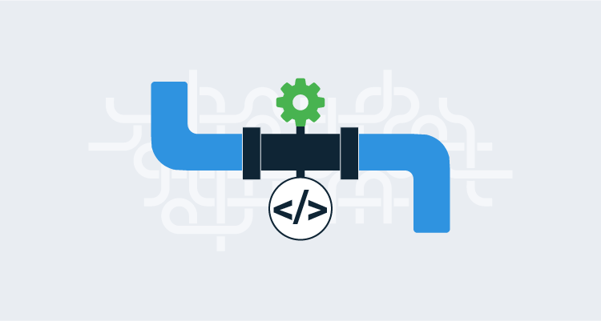

# Pipeline Execution Report

## Summary
Despliegue automatizado de la API de tareas usando Jenkins y Docker.

## Steps
- Repositorio Git inicializado y conectado a GitHub
- Dockerfile configurado para contenerizar la API
- Jenkins configurado para clonar, instalar dependencias, ejecutar tests y crear imagen Docker

## Issues Encountered
- Problema inicial con las credenciales de GitHub en Jenkins (resuelto configurando token de acceso personal)
- Problemas con conexión, Jenkins no puede encontrar la rama especificada en el repositorio (origin/main)
- Resuelto origin/main (se crea acceso token en github y credencial Jenkins, modifica Jenkinsfile)

## Results

